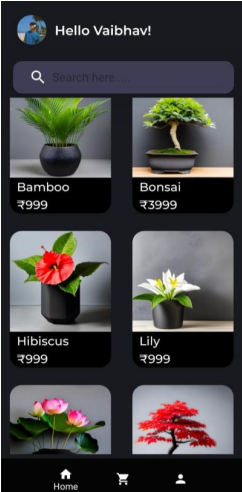
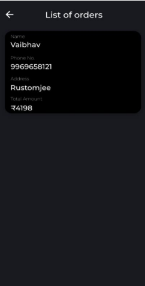
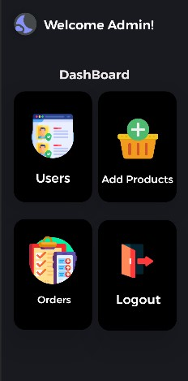
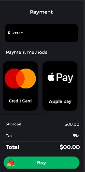
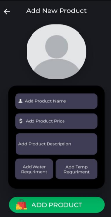

# Planty 🌱  
An elegant e-commerce application to buy and sell plants and soils.

---

## 🌟 Overview  
**Planty** is a mobile application designed for plant sellers and buyers. It provides a seamless experience for users to browse a variety of plants, add items to their cart, and make purchases. Admins can manage products and view orders with ease. The app features aesthetic design, smooth navigation, and Firebase integration for real-time updates and authentication.

---
## ✨ Features  

### **For Customers:**  
- **Authentication:**  
  - Firebase authentication with email and password.  
  - Secure password input with hide/unhide functionality.  

- **User Flow:**  
  - Splash screen → Login or Sign-Up.  
  - New users create a profile with name, phone number, address, and display picture.  
  - Returning users are greeted with their name and profile picture.  

- **Browse Plants:**  
  - Realtime Firebase RecyclerView for plant catalog with name, price, and image.  
  - Search bar for quick item lookup.  
  - Detailed product page with:  
    - Image, description, watering frequency, sunlight requirements, and price.  
    - Quantity input and “Add to Cart” functionality.  

- **Cart Management:**  
  - View all cart items with total price.  
  - Remove items from the cart.  
  - Proceed to order with subtotal, tax, and grand total calculation.  

- **Profile Page:**  
  - View and edit user details (name, email, phone, address, DP).  
  - Switch between light and dark themes.  
  - Logout option.  

- **Payment:**  
  - Multiple payment options.  
  - On successful purchase, items are removed from the cart, and orders are sent to the admin.  

### **For Admins:**  
- Firebase login for admin accounts.  
- Dashboard with the following options:  
  1. View all users and their details.  
  2. View all orders placed by customers.  
  3. Add new products or remove existing ones.  
  4. Manage products directly via Firebase.  

---
## 📱 Screenshots  
### Homepage:  
 

### Cart Page:  
 

### List Of Orders:  
 

### Login Page:  
 

### Admin Dashboard:  
  

###  Empty Cart Page:  
  

### Product Details:  
  

### Payment Page:  
  

### Add New Products Page in Admin:  
  

---
## 🛠️ Tech Stack  
- **Language:** Java  
- **UI:** XML  
- **IDE:** Android Studio  
- **Backend:** Firebase Authentication, Firebase Realtime Database, Firebase Storage  

---
## Install the App:
Alternatively, you can directly install the prebuilt APK in the repository under the releases folder.
